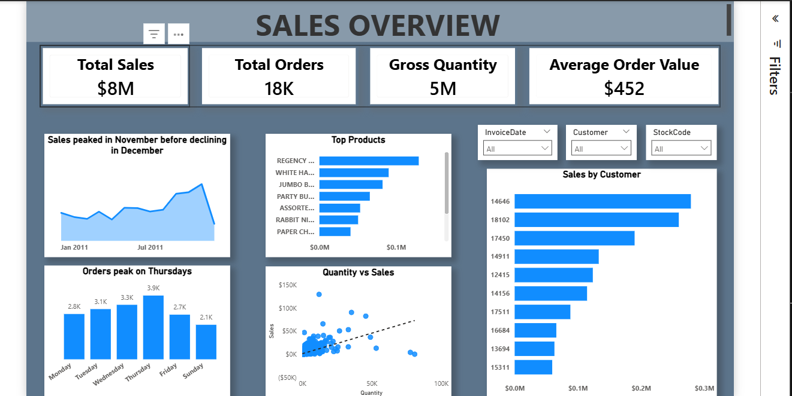

# 📊 Sales & Customer Analytics Dashboard

## 📌 Project Overview
This project analyzes customer transaction data to understand **what has happened in the business** using SQL for data preparation and Power BI for data modeling and visualization.

The project focuses on:
- Cleaning and structuring raw transactional data
- Normalizing a complex dataset into analytical tables based on grain
- Building a **Sales Overview Dashboard** that highlights trends, performance, and customer behavior

---

## 🗂 Dataset
- **Source:** Kaggle – Customer Data  
- **Type:** Transactional sales data with customer demographics  
- **Key Fields:** Invoice details, product information, quantities, prices, customer demographics, country, transaction type

---

## 🛠 Tools & Technologies
- **SQL (SQL Server)**
  - Exploratory Data Analysis (EDA)
  - Data quality checks and cleaning
  - Feature engineering
  - Table normalization
- **Power BI**
  - Data modeling and relationships
  - DAX measures for KPIs
  - Interactive dashboards and visuals

---

## 🔍 SQL Data Preparation

### 1. Exploratory Data Analysis
- Previewed raw data
- Analyzed:
  - Date range of transactions
  - Number of unique customers
  - Age, income, and price distributions

---

### 2. Data Quality Checks
Performed checks for:
- NULL values across key columns
- Zero and negative quantities
- Zero and negative unit prices
- Impossible age values

Problematic records were inspected before further processing.

---

### 3. Transaction Classification
Each transaction was classified into one of the following:
- **Sale**
- **Refund**
- **Discount**
- **Adjustment / Fee**

This ensured accurate revenue and quantity calculations.

---

### 4. Feature Engineering
Created additional analytical features:
- **Age Brackets**
- **Income Brackets**
- **Placeholder flags** for unreliable or default values (e.g., Age = 25, NULL CustomerID)

---

### 5. Outlier Detection
- Applied the **Interquartile Range (IQR)** method to UnitPrice
- Identified and quantified extreme price outliers

---

### 6. Grain Assessment & Normalization
The original dataset contained multiple grains (customer, invoice, product).  
It was normalized into the following tables:

- **Customer** – one row per customer  
- **Invoice** – one row per invoice  
- **OrderLine** – one row per product per invoice  

This structure improves data integrity and supports efficient analytics.

---

## 🧱 Data Model
The final model follows a **transactional star-style structure**:

- Customer → Invoice → OrderLine  
- Clean primary and foreign keys  
- Consistent grain across tables  
- Optimized for Power BI analysis

---

## 📈 Power BI Dashboard

### Dashboard Objective
To provide a **Sales Overview** answering the question:

> *What has happened in the business?*

---

### KPIs (DAX Measures)
- Total Sales  
- Total Orders  
- Total Quantity Sold  
- Average Order Value (AOV)

---

### Key Visuals & Insights
- **Sales Trend:**  
  - Sales peaked in **November**, followed by a decline in **December**
- **Orders by Day:**  
  - Orders tend to peak on **Thursdays**
- **Top Products:**  
  - Identified best-performing products by sales and quantity
- **Sales by Customer:**  
  - Highlighted high-value customers
- **Quantity vs Sales Scatter Plot:**  
  - Explored the relationship between volume and revenue

---

## 📊 Key Business Insights
- Strong seasonality with a clear November sales peak
- Consistent weekday purchasing behavior
- Revenue concentration among a subset of products and customers
- High sales value is not always driven by high quantity

---

## 🚀 What This Project Demonstrates
- Strong **SQL-based data cleaning and transformation**
- Clear understanding of **data grain and normalization**
- Ability to translate raw data into **business insights**
- Practical **Power BI modeling and DAX fundamentals**
- Analytical thinking focused on decision-making, not just visuals

---

## 📎 Project Files
- SQL scripts for EDA, cleaning, and normalization  
- Power BI dashboard file  
- Raw data
- README documentation  

---

## 📬 Contact
Feel free to connect or reach out if you’d like to discuss this project or provide feedback.

Email: nwabiaesther@gmail.com
